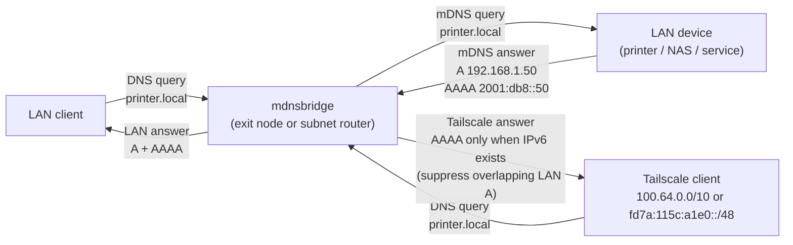
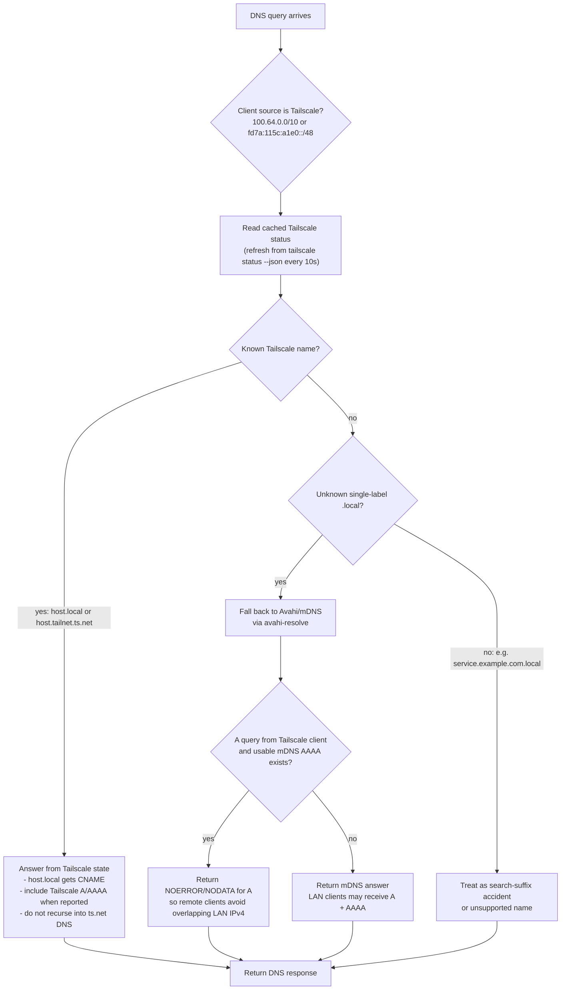

# mdnsbridge


DNS → mDNS bridge for `.local` hostnames. It answers normal DNS queries by asking `avahi-daemon` (via `avahi-resolve`), with a Tailscale-aware fast path for hosts that are already present in `tailscale status --json`.

This is handy when you want Bonjour names to work over Tailscale using **split-horizon DNS**, while still preferring live Tailscale addresses for machines that are part of your tailnet and avoiding overlapping LAN IPv4 answers for remote Tailscale clients when IPv6 is available.

## What it does

Tailscale clients can’t see mDNS broadcasts on your LAN. Run `mdnsbridge` on an exit node (or subnet router) that _can_ see the LAN, and point Tailscale’s split DNS for `local` at it.

For each query, `mdnsbridge` now checks live Tailscale state first:

1. If `host.local` matches a current Tailscale node hostname or MagicDNS label, it answers from `tailscale status --json`.
2. It returns a `CNAME` from `host.local` to the node’s MagicDNS name, plus final `A` / `AAAA` records when available.
3. If the query is already for a known MagicDNS name such as `host.tailnet.ts.net`, it answers directly from Tailscale state instead of recursing through DNS.
4. Unknown single-label `.local` names fall back to Avahi/mDNS.
5. For clients querying from Tailscale address space, LAN IPv4 `A` answers are suppressed when a usable mDNS `AAAA` exists, avoiding broken `192.168.x.x` answers on remote networks with overlapping private ranges.



## Why

I rely on `.local` hostnames and URLs when I'm at home, and wanted to be able to consistently access my services on the go. For me, this works fine for SSH, web, and most iOS applications that do "the right thing" and try to resolve names normally.

## Why Not

Applications that try to bypass OS name resolution and try to directly browse mDNS/Bonjour/Rendezvous won't work, because Tailscale does not bridge multicast packets. ZeroTier does, but I don't like its UX (which is why I switched to Tailscale in the first place).

## Tailscale-first resolution

The bridge treats Tailscale as the preferred source of truth for names that Tailscale already knows about.



This avoids DNS loops. In some deployments Tailscale DNS or MagicDNS may itself point at the bridge. For that reason, `mdnsbridge` does **not** resolve `*.ts.net` through DNS. It only answers known Tailscale names from the local `tailscale status --json` output. Unknown names are not forwarded to Tailscale DNS.

For unknown `.local` hosts resolved through Avahi, answers are source-aware:

- LAN clients keep normal mDNS behavior and may receive both `A` and `AAAA` records.
- Tailscale clients are detected by source address (`100.64.0.0/10` or `fd7a:115c:a1e0::/48`).
- When a Tailscale client asks for `A` and a usable mDNS `AAAA` exists, the bridge returns `NOERROR` with no `A` records instead of returning a potentially wrong LAN `192.168.x.x` address.
- This helps clients on remote networks that also use `192.168.1.0/24` prefer IPv6, Tailscale records, or CNAME/MagicDNS paths instead of trying an overlapping local subnet address.

Multi-label `.local` names such as `service.example.com.local` are treated as search-suffix accidents and are not sent to Avahi/mDNS.

## Relationship to Avahi

This requires you to have `avahi-daemon` running on the same node. `avahi-daemon` has a "reflector" mode, but that does not speak standard DNS--it only relays mDNS packets across interfaces (which Tailscale drops, so it's useless). This uses the `avahi-daemon` CLI tools to resolve unknown single-label `.local` names (because that is the simplest, easiest integration surface) and caches them, acting as a very simple DNS server.

## Build

```bash
make help
make build
make build-all
```

Cross-compiled binaries land in `dist/`.

## Install (systemd)

```bash
sudo make install
sudo systemctl status mdnsbridge
```

`make install` builds amd64 + armv7, detects the local architecture, and installs the right binary to `/usr/local/bin/mdnsbridge`.

## Configure Tailscale DNS (split DNS)

In the Tailscale admin console:

1. Open **Admin Console → DNS**.
2. Under **Nameservers**, choose **Split DNS**.
3. Add a rule:
   - **Domain:** `local`
   - **Nameserver:** the _Tailscale IP_ of the machine running `mdnsbridge` (e.g. `100.64.0.5`)
4. Save. That’s it.

On Linux clients, ensure they accept DNS from Tailscale:

```bash
tailscale set --accept-dns=true
```

Test from a client:

```bash
dig @100.64.0.5 printer.local +short
ping printer.local
```

## Notes

- Needs `avahi-daemon` and `avahi-resolve` (`avahi-tools` / `avahi-utils`) for mDNS fallback.
- Uses `tailscale status --json` when the `tailscale` CLI is available; if it is unavailable or times out, Tailscale matching is skipped and `.local` fallback still works.
- Listens on IPv4 `:53` and IPv6 `[::]:53` by default (UDP + TCP).
- Use `-addr4` or `-addr6` to override or disable a family (set empty to disable).
- `-addr` is deprecated; it maps to `-addr4` for backward compatibility.
- Examples:
  - IPv4 only: `mdnsbridge -addr6 ""`
  - IPv6 only: `mdnsbridge -addr4 ""`
- Caches mDNS results briefly (positive 5s, negative 2s) and Tailscale status for 10s.
- Runs `avahi-browse` on startup and every 5 minutes to refresh `avahi-daemon`.

## License

MIT
